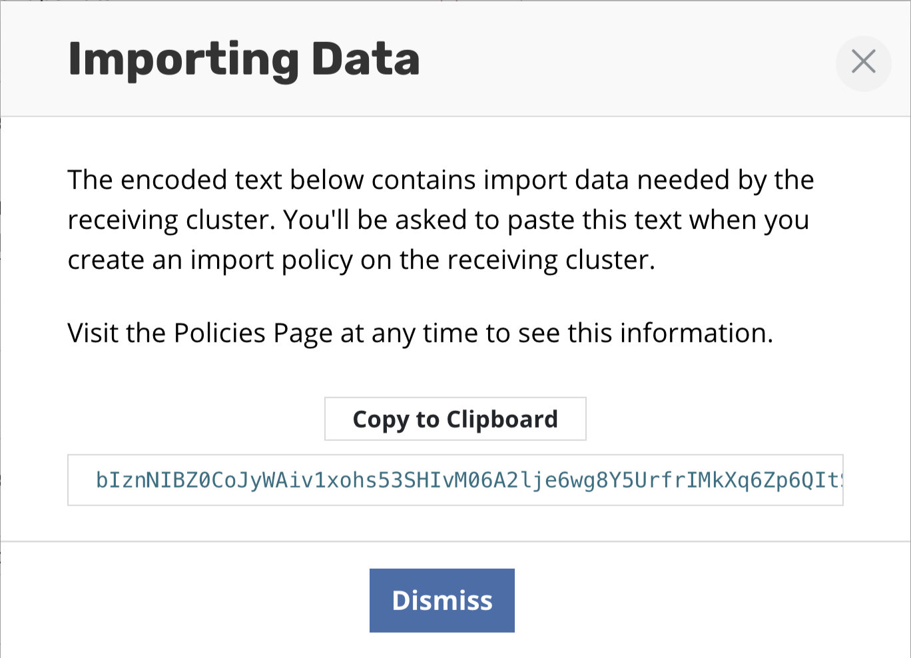
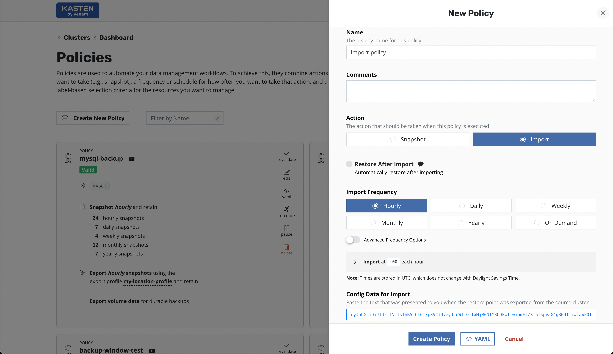

# K10-ExportImport-Ansible
***Status:** Work-in-progress. Please create issues or pull requests if you have ideas for improvement.*

# **Kasten K10 full automated Export and Import tasks with Ansible**
Example of using Ansible to automate K10 Export and Import policies to migrate applications to another Kubernetes cluster, or even to be used for Disaster Recovery purposes.

## Summary
This projects demostrates the process of exporting applications from a Production Kubernetes cluster using Kasten K10 policies, and then importing the same applications in a DR Production Kubernetes clusters using Kasten K10 Import Policies.  

All the automation is done using Ansible playbooks and leveraging the [Kasten K10 API](https://docs.kasten.io/latest/api/cli.html).

Kasten Export and Import policies can be used to migrate applications from one Kubernetes cluster to another (for instance from an on-prem Kubernetes cluster to an AWS EKS cluster), or even to provide a the tools for a Disaster Recovery strategy.

## Disclaimer
This project is an example of an deployment and meant to be used for testing and learning purposes only. Do not use in production. 

# Table of Contents

1. [Getting started](#Getting-started)
2. [Prerequisites](#Prerequisites)
3. [Exporting Applications on Production Kubernetes cluster](#Exporting-Applications-on-Production-Kubernetes-cluster)
4. [Importing Applications on Production Kubernetes cluster](#Importing-Applications-on-Production-Kubernetes-cluster)
5. [Parameters](#Parameters)
6. [Recovery duration](#Recovery-duration)

# Getting started

The ability to move an application across clusters is an extremely powerful feature that enables a variety of use cases including Disaster Recovery (DR), Test/Dev with realistic data sets, and performance testing in isolated environments.

In particular, the K10 platform is being built to support application migration and mobility in a variety of different and overlapping contexts:

* Cross-Namespace: The entire application stack can be migrated across different namespaces in the same cluster (covered in restoring applications).
* Cross-Cluster: The application stack is migrated across non-federated Kubernetes clusters.
* Cross-Account: Mobility can additionally be enabled across clusters running in different accounts (e.g., AWS accounts) or projects (e.g., Google Cloud projects).
* Cross-Region: Mobility can further be enabled across different regions of the same cloud provider (e.g., US-East to US-West).
* Cross-Cloud: Finally, mobility can be enabled across different cloud providers (e.g., AWS to Azure).

To learn more about Kasten K10 export policies, please check this link: https://docs.kasten.io/latest/usage/migration.html#exporting-applications.
To learn more about Kasten K10 import policies, please check this link: https://docs.kasten.io/latest/usage/migration.html#importing-applications

## Prerequisites

To run this project you need to have some software installed and configured: 
1. A workstation with the next tools installed:
	- Kubectl
	- Kubernetes Collection for Ansible
	- Helm
	- jq
	- (If restoring in AWS EKS) aws-cli, aws-iam-authenticator and a AWS named profile.
	- (If restoring in Azure AKS) azure cli 
	- (If restoring in Google GKE) gcloud CLI and gke-gcloud-auth-plugin for use with kubectl 
1. A working [Ansible installation](https://docs.ansible.com/ansible/latest/installation_guide/intro_installation.html).
1. A working Kubernetes cluster with applications to be exported to another location (Production cluster).  In this project, we will provide the Ansible Playbooks for the following tasks:
	  - Installing Kasten K10 in AWS EKS, Azure EKS or Google GKE.
	  - Configuring Kasten Location Profiles to export the Applications
	  - Configuring Kasten Export/Backup policies to protect the applications running in this cluster.  "Import Data" for every policy is captured by the Ansible playbook.

	

1. A working clean Kubernetes cluster to be used to import all applications from Production cluster using Kasten K10.  In this project we will provide the Ansible Playbooks for the following tasks.
	  - Installing Kasten K10 in AWS EKS, Azure EKS or Google GKE.
	  - Configuring Kasten Location Profiles containing the data of the applications to be imported.
	  - Configuring Kasten Import policies to import and restore the applications from the exported data.
1. Kasten K10 Export Policies protecting Kubernetes applications must have been run at least once to provide the required restore points for this project.

	
	

## Exporting Applications on Production Kubernetes cluster
Using K10 Export policies involves the following sequence of actions:

1. [Install Kasten K10 in the Production Kubernetes cluster](playbook/prod_cluster/01_k10_install.yaml).  This project includes an Ansible playbook to install Kasten K10 in AWS EKS, Azure AKS or Google GKE.
1. [Configuring Locations Profiles](playbook/prod_cluster/02_k10_loc_profiles.yaml) to provide storage resources where the applications are going to be exported to. In this project, we can create multiple Location Profiles by providing the required data in a [CSV file](playbook/prod_cluster/vars/storage.csv)
	  - profile_type (awss3, azblob, gcsa)
	  - bucket_name: The name used when the bucket was created in the Cloud Provider.
	  - profile_name: The name for the Kasten Location Profile:
	  - region: Region required for AWS and Google Cloud
1. [Configure Export Policies](playbook/prod_cluster/03_k10_create_policy.yaml) for every application running in the Production cluster.   In this project, the Policies can be created automatically IF a label has been assigned to every NAMESPACE with one of these values:
	  - backup=hourly for hourly backup
	  - backup=daily for daily backup
	  - backup=weekly for weekly backup
	  - backup=monthly for monthly backup

**NOTE**: The Export Policies playbook will create a CSV file with the name of the applications and the import string.  This file is called "importpolicy.yaml" and it's located in [Create Policy folder](playbook/prod_cluster/createpolicy).   This file MUST be copied to the following location keeping the same name: [playbook/dr_cluster/createpolicy](playbook/dr_cluster/createpolicy)

All these steps will be automated using the Ansible playbooks provided for the [Production Cluster](playbook/prod_cluster)

**Important**: The playbooks must be run in the mentioned order in order to make the recovery process works.

## Importing Applications on Production Kubernetes cluster
Using K10 Import policies involves the following sequence of actions:

1. [Install Kasten K10 in the Production Kubernetes cluster](playbook/dr_cluster/01_k10_install.yaml).  This project includes an Ansible playbook to install Kasten K10 in AWS EKS, Azure AKS or Google GKE.
1. [Configuring Locations Profiles](playbook/dr_cluster/02_k10_loc_profiles.yaml) to provide storage resources where the applications are going to be exported to. In this project, we can create multiple Location Profiles by providing the required data in a [CSV file](playbook/prod_cluster/vars/storage.csv)
	  - profile_type (awss3, azblob, gcsa)
	  - bucket_name: The name used when the bucket was created in the Cloud Provider.
	  - profile_name: The name for the Kasten Location Profile:
	  - region: Region required for AWS and Google Cloud
1. [Configure Import Policies](playbook/dr_cluster/03_k10_create_imports.yaml) for every application to be imported in the DR Cluster.   In this project, the Ansible playbook will run the following actions:
	  - Create the import policy for every application exported and registered in the [Import Policy CSV file](playbook/dr_cluster/createpolicy/importpolicy.yaml)
	  - Add the Import String from the same CSV File.
	  - Set the Import Policy to restore the entire app and its data after importing it.

All these steps will be automated using the Ansible playbooks provided for the [Production Cluster](playbook/prod_cluster)

**Important**: The playbooks must be run in the mentioned order in order to make the recovery process works.

## Parameters
**Deployment parameters:**
Some deployment variables must be set into the vars files.  Alter the parameters according to your needs:
1. [For Production Cluster](playbook/prod_cluster/vars/vault_vars.yaml) "vault_vars.yaml" in the playbook/prod_cluster/vars folder.
	  - k10_infra: Choose between AWSEKS, AZAKS and GCGKE
	  - aws_access_key_id: AWS Access Key to add AWS S3 bucket
	  - aws_secret_access_key: AWS Secret Access Key to add AWS S3 bucket
	  - tenantID: Azure Tenant ID to add Azure Blob
	  - azureclientID: Azure Client ID to add Azure Blob
	  - Azureclientsecret: Azure Client Secret to add Azure Blob
	  - azure_storage_key: Azure Storage Access Key to add Azure Blob
	  - azure_storage_env: AzureCloud is the default in Azure.  More info in https://docs.kasten.io/latest/usage/configuration.html#azure-storage
	  - project_id: Google Project ID to add Google Cloud Storage Account
	  - LOGIN: For K10 Basic Authentication.  Use 'htpasswd -n admin' and provide a password to autenticate to Kasten K10
1. [For DR Cluster](playbook/dr_cluster/vars/vault_vars.yaml)  "vault_vars.yaml" in the playbook/dr_cluster/vars folder.
	  - k10_infra: Choose between AWSEKS, AZAKS and GCGKE
	  - aws_access_key_id: AWS Access Key to add AWS S3 bucket
	  - aws_secret_access_key: AWS Secret Access Key to add AWS S3 bucket
	  - tenantID: Azure Tenant ID to add Azure Blob
	  - azureclientID: Azure Client ID to add Azure Blob
	  - Azureclientsecret: Azure Client Secret to add Azure Blob
	  - azure_storage_key: Azure Storage Access Key to add Azure Blob
	  - azure_storage_env: AzureCloud is the default in Azure.  More info in https://docs.kasten.io/latest/usage/configuration.html#azure-storage
	  - project_id: Google Project ID to add Google Cloud Storage Account
	  - LOGIN: For K10 Basic Authentication.  Use 'htpasswd -n admin' and provide a password to autenticate to Kasten K10

**NOTE**: It is recommended to use Ansible Vaults to keep this data instead of using just a text file, considering all the sensitive data to be kept here.

# Recovery duration

The entire recovery process will take approx 30 minutes plus the time required for applications and data to recover. 
